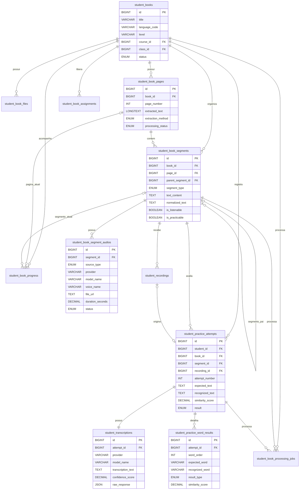

# Modelagem de banco — Livro do Aluno Interativo

Este documento explica as relações do banco propostas para o MVP. O diagrama interativo completo também está disponível na seção **Banco** do site React.

## Visão geral

A modelagem foi separada em quatro domínios:

1. **Conteúdo:** livro, arquivos, páginas e segmentos.
2. **Distribuição:** público autorizado e progresso.
3. **Prática:** gravações, tentativas, transcrições e resultado por palavra.
4. **Processamento:** jobs assíncronos de PDF, OCR, TTS, transcrição e limpeza.

A separação evita colocar PDF, áudio, transcrição, progresso e avaliação em uma única tabela difícil de manter.

## Diagrama entidade-relacionamento



## Relações principais para explicar na reunião

### Livro → páginas → segmentos

```text
student_books
    1 ───── N student_book_pages
                  1 ───── N student_book_segments
```

O PDF é dividido em páginas. Cada página contém segmentos interativos, como palavra, frase, diálogo ou exercício.

O `student_book_segments` é a unidade central do produto porque ele conecta:

- a posição visual dentro da página;
- o texto esperado;
- o áudio de referência;
- a gravação do aluno;
- as tentativas e o progresso.

### Segmento → áudio de referência

```text
student_book_segments
    1 ───── N student_book_segment_audios
```

Um segmento pode ter mais de um áudio:

- voz TTS padrão;
- voz alternativa;
- gravação humana;
- versão lenta;
- áudio original do material.

O MVP pode usar apenas um áudio ativo, mas a relação `1:N` evita limitar evoluções futuras.

### Segmento → gravação → tentativa

```text
student_book_segments
    1 ───── N student_recordings
                  0..1 ───── 1 student_practice_attempts
```

A gravação é separada da tentativa porque possui ciclo de retenção próprio. Ela pode ser apagada após a transcrição sem apagar o resultado pedagógico.

Recomendação técnica: adicionar uma restrição `UNIQUE` em `student_practice_attempts.recording_id` caso seja confirmado que uma gravação só pode pertencer a uma tentativa.

### Tentativa → transcrição

```text
student_practice_attempts
    1 ───── 1 student_transcriptions
```

A tentativa guarda o resultado funcional. A transcrição guarda informações específicas do provedor:

- modelo utilizado;
- idioma;
- resposta bruta;
- confiança retornada;
- texto reconhecido.

Essa separação permite trocar Whisper por outro Speech-to-Text sem alterar a tabela principal de tentativas.

### Tentativa → resultado por palavra

```text
student_practice_attempts
    1 ───── N student_practice_word_results
```

Essa tabela permite montar o feedback visual:

- `match`: palavra reconhecida;
- `similar`: palavra semelhante;
- `omission`: palavra ausente;
- `insertion`: palavra inserida;
- `substitution`: palavra diferente.

### Livro → progresso do aluno

```text
student_books
    1 ───── N student_book_progress
```

Existe apenas um progresso por combinação `livro + aluno`, garantido por índice único.

A tabela armazena:

- página atual;
- segmento atual;
- percentual;
- quantidade de frases ouvidas;
- quantidade de frases praticadas;
- último acesso;
- conclusão.

## Por que não salvar tudo em JSON?

Campos JSON são úteis para respostas externas e configurações variáveis, mas os dados consultados frequentemente devem permanecer relacionais.

Relacional:

- livro, página e frase;
- aluno e progresso;
- tentativa e resultado;
- status e datas;
- campos utilizados em filtros e relatórios.

JSON:

- resposta bruta do provedor;
- configurações de geração TTS;
- entrada e saída de jobs;
- metadados pouco previsíveis.

## Decisões técnicas da modelagem

### IDs numéricos

O modelo utiliza `BIGINT UNSIGNED`, seguindo o padrão do banco atual. UUID pode ser usado externamente caso os IDs não devam ser expostos na API.

### Texto esperado duplicado na tentativa

`expected_text` é salvo também em `student_practice_attempts`, mesmo existindo no segmento.

Motivo: manter um snapshot histórico. Se o admin corrigir a frase depois, a tentativa antiga continua representando o texto que foi apresentado ao aluno naquele momento.

### Texto normalizado

Os campos normalizados evitam repetir o processamento de:

- caixa alta e baixa;
- pontuação;
- espaços duplicados;
- contrações permitidas;
- caracteres especiais.

### Relação polimórfica de assignments

`assignment_type + reference_id` permite liberar o livro por aluno, turma, curso ou globalmente.

Trade-off: o banco não consegue criar uma única foreign key para múltiplas tabelas. Se a equipe preferir integridade referencial rígida, podem ser criadas tabelas separadas:

- `student_book_student_assignments`;
- `student_book_class_assignments`;
- `student_book_course_assignments`.

### Gravações e LGPD

O modelo suporta três estados:

- `temporary`;
- `retained`;
- `deleted`.

Isso permite transcrever o áudio, armazenar as métricas e apagar o arquivo original conforme a política definida pela empresa.

## Índices importantes

- `student_book_pages(book_id, page_number)` — único.
- `student_book_segments(page_id, sort_order)`.
- `student_book_progress(book_id, student_id)` — único.
- `student_practice_attempts(student_id, segment_id, attempt_number)` — único.
- `student_practice_attempts(segment_id, result)`.
- `student_recordings(retention_status, delete_after)`.
- `student_book_processing_jobs(status, job_type)`.

## Perguntas que o tech lead pode fazer

### Por que `book_id` e `page_id` existem juntos em segments?

`page_id` já leva ao livro, mas `book_id` facilita filtros e índices frequentes. É uma desnormalização controlada. Pode ser removido caso a equipe prefira normalização estrita.

### Por que existe `recognized_text` em attempts e em transcriptions?

`attempts.recognized_text` é a versão funcional usada pelo produto. `transcriptions.transcription_text` registra a resposta do provedor. A aplicação pode normalizar ou corrigir o valor antes da comparação.

### O áudio deve ficar no banco?

Não. O banco armazena URL, caminho, metadados e status. O binário deve ficar em storage como S3 ou Cloudflare R2.

### O que acontece se o Whisper falhar?

A tentativa fica com estado de erro ou pendente, e um registro em `student_book_processing_jobs` controla retry, mensagem de erro e duração do processamento.

### É necessário Redis?

Não para salvar os dados. Redis/BullMQ é recomendado para executar TTS, OCR, transcrição e limpeza de arquivos fora da requisição HTTP.

### Como evitar custos de TTS repetidos?

O áudio é gerado uma vez por segmento e armazenado. Só deve ser regenerado quando o texto, a voz ou as configurações forem alterados.

### Como evitar salvar gravações indefinidamente?

Um job `cleanup_recording` busca registros com `delete_after` vencido, remove o arquivo do storage e atualiza `retention_status` para `deleted`.

## Pontos que ainda dependem de validação

- nomes reais das tabelas de alunos, cursos, turmas e usuários;
- ORM já utilizado no projeto;
- política de retenção das gravações;
- necessidade de múltiplos áudios por frase;
- regra exata de aprovação da tentativa;
- uso de TTS, áudio humano ou ambos;
- necessidade de guardar a resposta bruta do provedor;
- volume esperado de alunos e tentativas.
